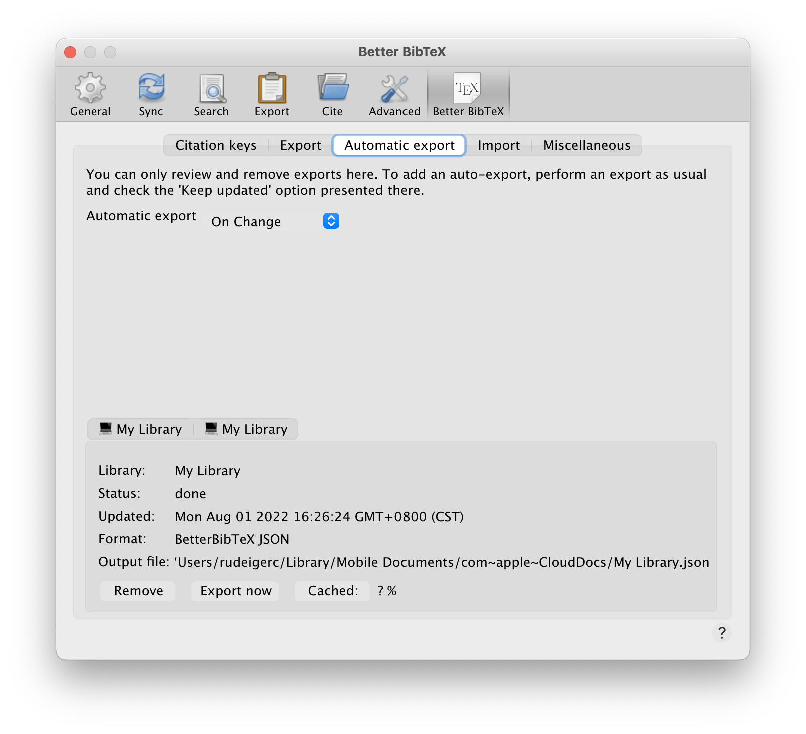
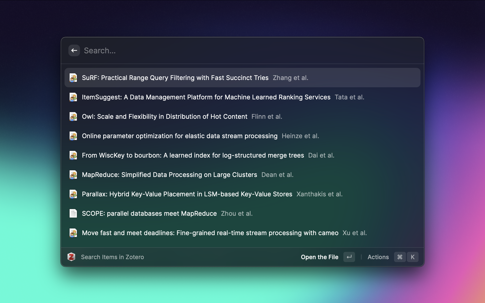
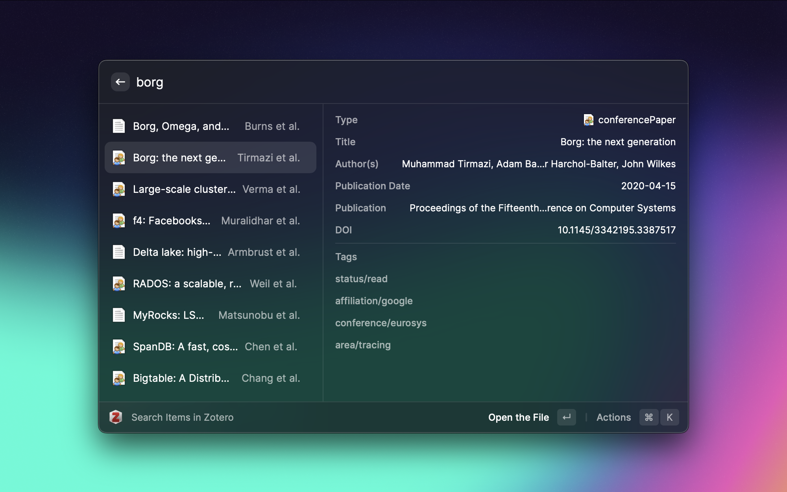

# Raycast Zotero Extension

A [Raycast](https://raycast.com/) extension for Zotero.

## Requirements

[Better BibTeX for Zotero](https://retorque.re/zotero-better-bibtex/) is required. Please make sure `Better BibTex > Automatic Export` is enabled.

## Preferences

- `zoteroBetterBibtexOutputFilePath`: Path to locate Better BibTex output file.

## Demo

<small>(Theme: [Ray of Lights](https://www.raycast.com/uploads/wallpapers/ray-of-lights.png))</small>
